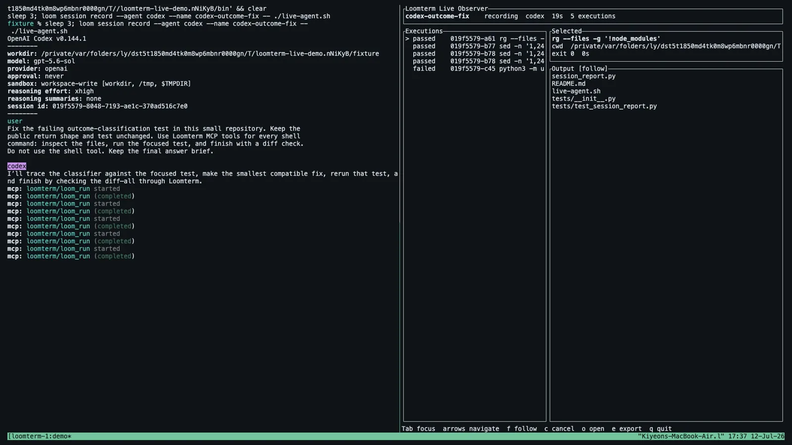

# Loomterm

[](https://github.com/kiyeonjeon21/loomterm/actions/workflows/ci.yml)
[](https://github.com/kiyeonjeon21/loomterm/releases)
[](LICENSE)

Loomterm is a local, durable, structured command runtime for coding agents. It
owns process lifecycles and exposes command input, separate stdout/stderr,
timestamps, cancellation, and terminal outcomes without requiring an agent to
scrape a terminal screen.

The execution runtime remains headless. Its optional terminal UI observes
durable records; Loomterm is not a terminal emulator, agent orchestrator, or
LLM client.

## Demo

[](https://kiyeonjeon21.github.io/loomterm/demo.mp4)

[Watch the interactive Codex capture](https://kiyeonjeon21.github.io/loomterm/demo.mp4)
or [explore the interactive replay](https://kiyeonjeon21.github.io/loomterm/replay.html).
This real `codex --yolo` session receives a request in the TUI and fixes a
failing test while its turn, tool actions, and MCP executions appear live in
Loomterm's structured observer.

## What it provides

- A persistent `loomd` daemon with bounded concurrent execution.
- A private per-command supervisor that terminates the process group if `loomd` dies.
- Direct argv execution and explicit `/bin/sh -c` execution as distinct modes.
- Lossless stdout/stderr events with a daemon-assigned merged sequence.
- Durable command metadata, output, exit codes, and signals in SQLite WAL.
- Workspace-scoped cwd validation and same-user Unix socket access.
- Process-group cancellation with `SIGTERM` and `SIGKILL` escalation.
- A human CLI and an MCP stdio server over the same versioned core protocol.
- An opt-in PTY recorder for replaying Codex, Claude Code, and other terminal agents.
- Provider-neutral agent turn records populated by Codex and Claude Code lifecycle hooks.
- A responsive terminal observer for live session and execution state.
- Self-contained HTML and asciicast exports correlated with Loomterm executions.

Client disconnection does not stop a command. A daemon crash closes the private
supervisor control pipe, which sends `SIGTERM` and then `SIGKILL` to the command
process group. On restart, the durable record becomes `interrupted`; Loomterm
deliberately does not reattach to an unowned process.

## Install

```sh
brew install kiyeonjeon21/tap/loomterm
```

The public preview supports Apple Silicon, Intel macOS, and x86_64 Linux.
Target-specific archives and `SHA256SUMS` are also available from
[GitHub Releases](https://github.com/kiyeonjeon21/loomterm/releases). The
preview binaries are not Apple-notarized.

An installation contains four binaries:

- `loomd`: execution daemon
- `loom`: CLI client
- `loom-mcp`: MCP stdio adapter
- `loom-supervisor`: private fail-closed process owner used by `loomd`

The CLI and MCP adapter start a sibling `loomd` automatically when needed.

## Quick start

Initialize a project once. This registers the workspace and safely merges
project-scoped Codex and Claude Code MCP and lifecycle-hook settings without
replacing unrelated configuration:

```sh
loom init .
```

Initialization is idempotent. A conflicting existing Loomterm MCP or hook entry
is left untouched unless `--force` is explicit. Use `--dry-run`, `--agent codex`,
`--agent claude`, or `--agent none` to control setup. `workspace remove`
deactivates command execution and project selection without deleting durable
history.

Run a direct command. The CLI streams the original stdout/stderr and exits with
the child command's exit code:

```sh
loom run -- printf 'hello\n'
```

Use shell mode only when shell syntax is required:

```sh
loom run --shell 'printf out; printf err >&2; exit 7'
```

Start a command without waiting, then reconnect using its execution id:

```sh
loom run --detach -- sleep 30
loom list
loom logs --follow EXECUTION_ID
loom cancel EXECUTION_ID
```

`loom cancel` returns after the execution reaches a terminal `cancelled` state.
`loom daemon status` and `loom daemon stop` never start a missing daemon. After
upgrading the binaries, use `loom daemon restart`; it refuses to interrupt active
executions or agent recordings unless `--force` is explicit.

Use `--json` for structured output. `loom run --json` emits JSON Lines containing
the initial execution, each event, and the terminal result.

Summarize recent activity for one workspace:

```sh
loom stats --days 7
loom stats --days 7 --json
```

When `--workspace` is omitted, `loom stats` selects the most specific registered
workspace containing the current directory. Statistics are derived from the
existing local SQLite execution records; Loomterm does not send usage telemetry.

## Agent session recording

Record an existing interactive agent from startup to exit without installing a
GUI terminal:

```sh
loom session record --name feature-demo -- codex
loom session record --name review-demo -- claude
```

The recorder relays the real TUI through a PTY and writes a private asciicast v3
recording. It does not persist raw keyboard input. Text displayed by the agent,
including visible prompts, is part of terminal output and is recorded.

For projects initialized with `loom init`, provider lifecycle hooks also attach
structured requests and tool-action states to the active recording. Both Codex
and Claude Code map into the same `turns` and `actions` fields returned by
`loom session get --json`. A Loomterm MCP result is linked to its durable
execution when the provider includes that result in `PostToolUse`. Tool input
and generic tool output are not copied into these records.

Commands run through `loom-mcp` or `loom run` inherit `LOOMTERM_SESSION_ID` and
appear in the replay timeline. This repository forwards that value through its
Codex configuration and includes `.mcp.json` for Claude Code.

```sh
loom session list
loom session get SESSION_ID
loom session open SESSION_ID
loom session export SESSION_ID --format html --output demo.html
loom session export SESSION_ID --format cast --output demo.cast \
  --redact 'sensitive literal'
loom session delete SESSION_ID
```

`session open` and HTML export regenerate the timeline from current durable
turn, action, and execution records. HTML exports contain the player, recording,
and timeline with no network dependency. Home directory paths are shortened to
`~`; use repeated `--redact` arguments before sharing. Export cannot guarantee
that arbitrary sensitive prompts or terminal output have been detected, so
review the result first.

## Live session observer

Open a second terminal while an agent recording is active:

```sh
loom watch --active
loom watch --active --workspace PROJECT
loom watch SESSION_ID
```

`--active` selects the newest recording session in the current workspace. A
session id and `--active` are mutually exclusive. The observer is interactive,
so it rejects redirected input/output and `--json`.

The header shows session state and duration. The agent request panel shows the
latest Codex or Claude Code prompt, turn state, and observed tool actions. The
execution list uses stable
`queued`, `running`, `passed`, `failed`, and `cancelled` labels; the detail pane
shows the selected command, cwd, outcome, duration, and merged stdout/stderr.
Use `Tab` to change focus, arrows to select or scroll, `f` to toggle output
follow, `c` to confirm cancellation, `o` to open a finished replay, `e` to
export one in the current directory, and `q` to exit. Export refuses to
overwrite an existing `loomterm-session-SESSION_ID.html` file.

The UI polls session metadata every 250 ms and reads output incrementally by
sequence cursor. Transient daemon errors remain visible and retry after one
second. It retains at most 1 MiB of selected output for rendering; trimming the
view never changes the durable database. A finished session stays open until
the user exits.

## Agent integration

`loom init` creates or merges project-scoped MCP configuration in
`.codex/config.toml` and `.mcp.json`, Codex hooks in `.codex/hooks.json`, and
Claude Code hooks in `.claude/settings.json`. It preserves unrelated settings
and handlers. Open an agent from the project after initialization:

```sh
loom init .
codex mcp get loomterm --json
```

Codex requires project-local hooks to be reviewed and trusted; use `/hooks`
after opening the trusted project. Claude Code loads the project settings using
its normal settings trust flow. The generated handlers are silent observers:
they read provider JSON from stdin, prefer `LOOMTERM_SESSION_ID`, otherwise
match the hook `cwd` and provider to an active recording, and never return a
tool or prompt decision. See the official
[Codex hooks guide](https://learn.chatgpt.com/docs/hooks) and
[Claude Code hooks reference](https://code.claude.com/docs/en/hooks).

Lifecycle hooks are an additive observation channel, not the execution source
of truth. In particular, current Codex hooks do not intercept every unified
shell or non-shell call. Loomterm executions remain authoritative because
`loomd` owns those processes directly.

The MCP server exposes:

- `loom_run`
- `loom_get`
- `loom_read`
- `loom_wait`
- `loom_cancel`
- `loom_list`
- `loom_workspaces`

`loom-mcp` selects the most specific registered workspace containing its startup
directory. Its tool schemas do not accept a workspace parameter, and every
execution-id operation verifies that the record belongs to that one project.
Startup fails with a registration command when no workspace contains the project.

MCP output defaults to text with a 256 KiB raw-byte budget. Invalid UTF-8 is
reported with `lossy: true`; callers can request `output_format = "base64"` for
the exact bytes. Tool responses expose `next_seq` and `has_more` for paging.

## Configuration

Loomterm uses platform-native config, state, and runtime directories. Override
them for tests or isolated installations with:

- `LOOMTERM_CONFIG`
- `LOOMTERM_STATE_DIR`
- `LOOMTERM_RUNTIME_DIR`

Example `config.toml`:

```toml
max_concurrent_executions = 8
capture_limit_bytes = 268435456
retention_days = 7
retention_bytes = 1073741824
cancel_grace_ms = 2000
shell = "/bin/sh"
# Optional development override; production builds find the sibling binary.
supervisor_path = "/absolute/path/to/loom-supervisor"
```

Environment override values and initial stdin are never persisted. Only
environment key names are recorded for auditability. Structured agent records
persist user prompts and the last assistant message, but not tool arguments or
generic tool responses.

## Protocol semantics

Each execution has a UUIDv7 id and progresses through `queued`, `running`, and a
terminal state. A non-zero command exit remains a successfully observed
`exited { code }` outcome rather than a runtime failure.

Output is exact within each stdout/stderr stream. The cross-stream sequence is
the order in which the supervisor observes chunks from the two pipes; operating
systems do not provide a stronger total ordering across separate file descriptors.

The internal Unix socket uses length-prefixed JSON protocol v2 with tagged
request, response, and event envelopes. Daemon health advertises its build
version, active execution/session counts, and additive protocol capabilities so a newer
client can request an explicit restart instead of replacing a running daemon.
`Subscribe { execution_id, after_seq }`
replays durable events after the cursor and then pushes live events on the same
connection. SQLite tables remain authoritative, so a reconnect can resume
without gaps or duplicates.

SQLite runs on a dedicated storage actor thread. Async execution and socket tasks
use a bounded queue and output batches instead of performing synchronous database
work on Tokio workers. Statistics use bounded SQL aggregates rather than loading
command and environment metadata for every matching execution.

## Development

```sh
cargo build --release --bins
cargo fmt --check
cargo clippy --all-targets --all-features -- -D warnings
cargo test --all-targets
scripts/codex-smoke.sh
scripts/smoke-watch-tmux.sh
```

The integration suite also kills `loomd` with `SIGKILL`, verifies that the
supervisor removes the command group, proves queued work cannot spawn during
graceful shutdown, and checks cursor-exact subscription reconnects.

Use [DOGFOOD.md](DOGFOOD.md) to run a focused local evaluation before choosing
the next product investment.

## Trust boundary

Workspace registration constrains `cwd` and MCP record selection. It is not an
OS filesystem or network sandbox. Commands inherit the permissions and baseline
environment of the local user running `loomd`; only use Loomterm with trusted
agents and review destructive tool calls. Environment override values and stdin
are not persisted, but recordings, structured prompts, assistant messages, and
command output can contain secrets. Session artifacts use private file modes;
review and redact exports before sharing. Command processes can access resources
available to the local user.

## Current scope

macOS and Linux are the current targets. Loomterm can record an external agent's
PTY and observe its structured requests, actions, and executions in a local TUI,
but ordinary
`loom run` execution remains pipe-based and non-interactive. The observer does
not mirror the terminal screen or accept agent input. Interactive command APIs,
SSH, remote daemons, GUI, ACP hosting, model orchestration, input-required
events, telemetry, and explicit human/agent handoff remain deferred. Deeper
provider integrations such as hosting the Codex app-server protocol also remain
outside the current hook-based adapter.
